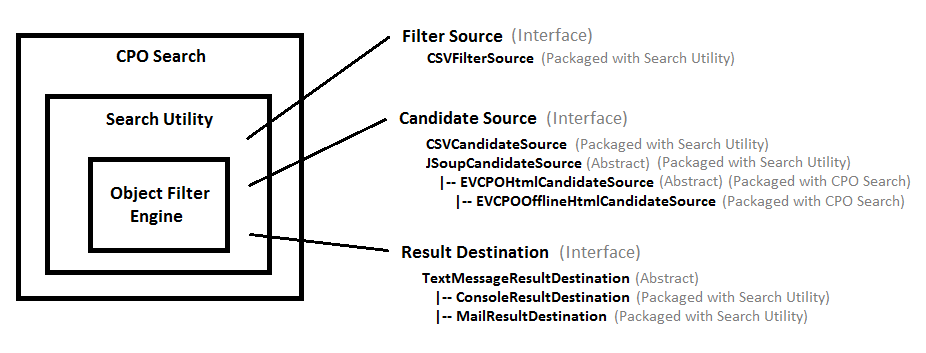

# Project Description

Object Filtering Engine for running collections of objects against a set of filters.

# Background

This project was born out of my desire to write my own application for searching the list of used Tesla Model S cars available through the Tesla Certified Pre-Owned (CPO) program.  However, the core searching system was potentially applicable to anything, so instead of writing an application just for Tesla Model S searches, I wrote a generic Object Filtering Engine (OFE) and made the Tesla Model S search program an example application for that search engine.  I had previously used the name XanderCat as a base name for my software projects, thus was born XanderCat OFE.

XanderCat OFE currently consists of 3 parts:  The Object Filtering Engine, the Search Utility, and the example applications which, for the moment, includes only the Tesla Model S search application.

# The Object Filtering Engine

At the core is the Object Filtering Engine.  It is something you can construct, add filters to, run candidate objects through, collect statistics*, get a list of ranked matches, and compare those matches to previous matches.

_* statistics collection is available starting with XanderCat OFE version 1.2_

# The Search Utility

The Search Utility utilizes the Object Filtering Engine, and adds to that some structure to identify where the filters are coming from, where the candidate objects are coming from, where statistics collectors are coming from, and where the results are sent to.  Included with it are some basic implementations of filter sources, candidate sources, statistics collector sources, and result destinations.  Search Utility can optionally be used as the main executable class.

# Example Application:  Tesla Model S CPO Search

The Tesla Model S CPO Search application utilizes the Search Utility.  It includes a class to represent a CPO Tesla Model S, along with some specific candidate sources specifically for obtaining lists of the available Model S inventory.

# CSV / Non-Java Support

XanderCat OFE has been written with varying levels of Comma Separated Value (CSV) support to allow people to use XanderCat OFE without needing to do any Java programming.  However, this support does not provide access to all of the functions available in XanderCat OFE.  Please provide feedback if you would like to see the existing CSV support expanded beyond what it currently provides.

CSV support in XanderCat OFE 1.2 is limited as follows:

| Function/Capability |  CSV Support |
| --- | --- |
| Source Objects / Candidates | A custom Java class to represent the source objects is optional; if not provided, a generic MapCandidate class is used as described elsewhere in the documentation. |
| Candidate Sources | Data for the application can be provided through the use of the CSVCandidateSource class. |
| Filters |  Common filters are supported through the use of the CSVFilterSource class.  However, the AggregateFilter that combines multiple filters into a single filter is _not_ supported. |
| Stat Collectors | There is currently no CSV support for Stat Collectors. |
| Result Destinations | The ConsoleResultDestination and MailResultDestination classes provide a means to send all relevant results in a text message. |

# Documentation

For more information, see the [Documentation](Documentation.md).

